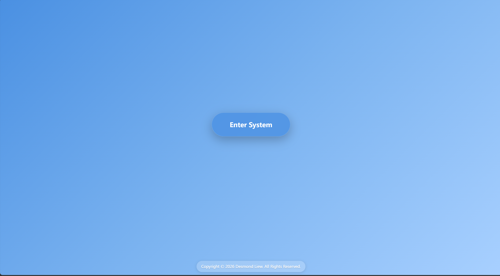
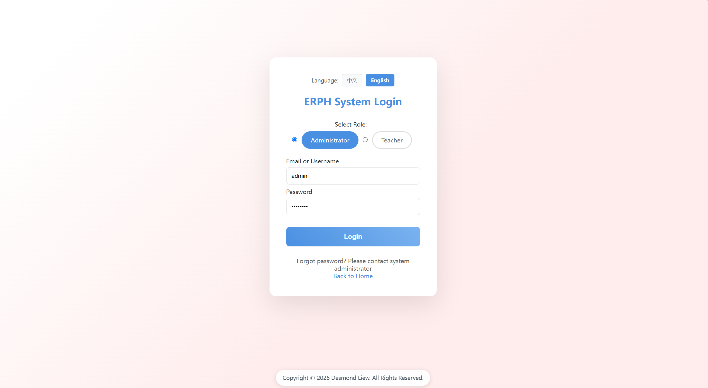
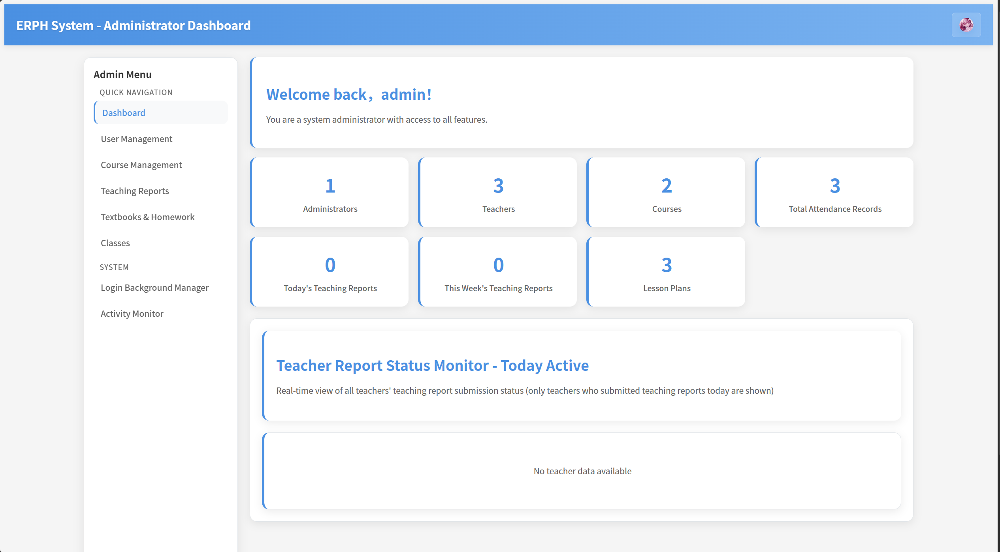
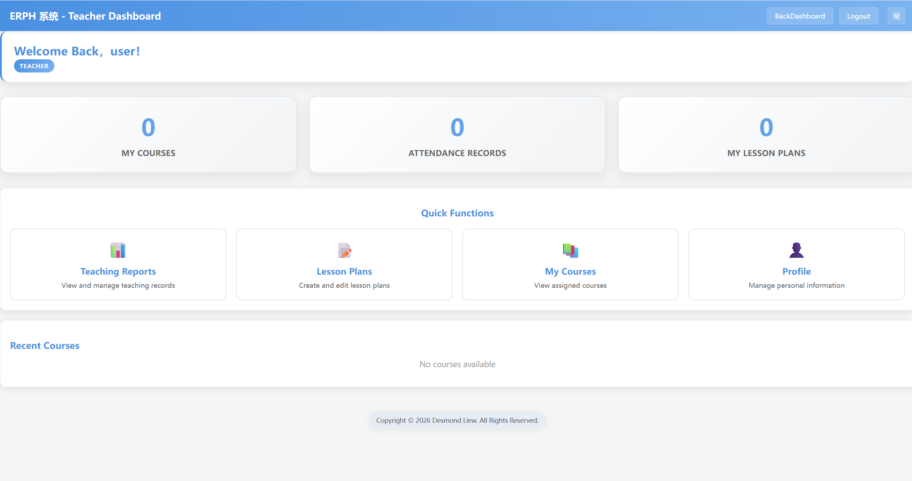
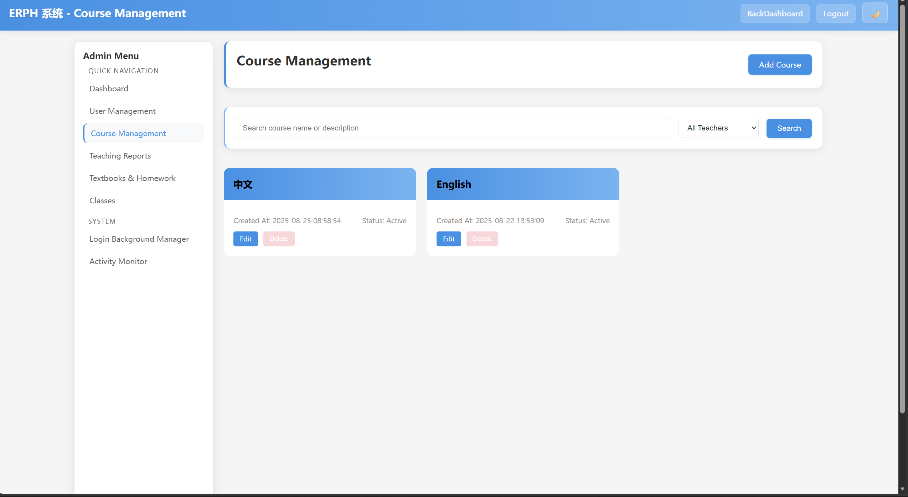
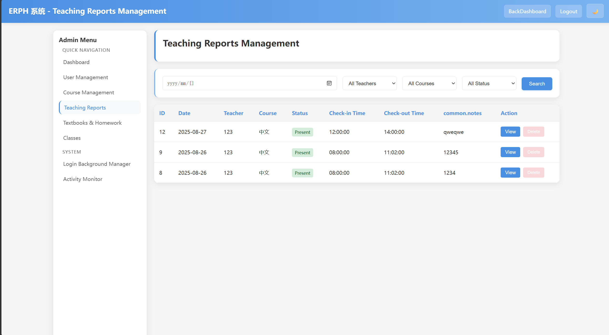

# 📚 E-RPH — Electronic Resource Planning for Higher Education

**E-RPH** is a school teaching-resource platform for **administrators** and **teachers**.  
Manage users, courses, classes, lesson plans, teaching reports, textbooks & homework — with **EN / 中文**, dark mode, and an in-app user manual. Built with **PHP · HTML · CSS · JavaScript · MySQL** on XAMPP.

---

## ✨ Features

### 🔐 Role-Based Login
Pick **Admin** or **Teacher**, sign in with email/password, and land on the matching dashboard. Sessions are protected with role checks on every management page.

### 📊 Admin & Teacher Dashboards
Admins see user/course/report stats and today’s teacher activity. Teachers see their assigned courses, teaching reports, and lesson-plan counts at a glance.

### 👥 User & Course Management
Create and edit users (roles, profiles). Manage courses with **multi-teacher** assignment, classes, and related teaching resources.

### 📝 Teaching Reports & Lesson Plans
Teachers submit teaching/attendance-style reports for courses. Upload and organize lesson plans with version tracking. Admins can review reports across the school.

### 📖 Textbooks, Homework & Classes
Link textbooks/homework materials to courses, and maintain class records used across the teaching workflow.

### 📈 Activity Monitor
Admins track login and page-access trends with charts and filters — useful for seeing who is active and when.

### 🎨 Login Background Manager
Choose preset gradients or upload a custom login/home background. Settings are stored in MySQL (`system_settings`).

### 🌐 Bilingual UI + Dark Mode
Switch **English / 中文** anytime. Toggle **light / dark** theme; preference stays with the session. Built-in **User Manual** follows the same language.

---

## 🏗️ Tech Stack

| Category | Technology |
|---|---|
| 🖥️ Frontend | HTML5, CSS3, JavaScript |
| 🔙 Backend | PHP 7.4+ |
| 🗄️ Database | MySQL 5.7+ / MariaDB (required) |
| 🏠 Local Server | XAMPP (Apache + MySQL) |
| ☁️ Hosting | Shared hosting friendly (e.g. iFastNet) |

---

## 📁 Project Structure

```
E-RPH/
├── index.php
├── config.php
├── db.php
├── setup_database.sql
├── assets/
│   └── screenshots/
├── public/
│   ├── login_roles.php
│   ├── admin_dashboard.php
│   ├── teacher_dashboard.php
│   ├── user_management.php
│   ├── course_management.php
│   ├── teaching_reports.php
│   ├── lessonplans.php
│   ├── textbooks_homework.php
│   ├── classes.php
│   ├── activity_monitor.php
│   ├── login_background_manager.php
│   ├── user_manual.php
│   ├── ajax/
│   ├── assets/
│   │   ├── css/
│   │   └── js/
│   └── inc/
│       ├── header.php
│       ├── footer.php
│       ├── admin_sidebar.php
│       └── translations/
├── uploads/
└── README.md
```

---

## ⬇️ Download & Run on Localhost

1. Download this project from GitHub:  
   **[Code → Download ZIP](https://github.com/dljk0927prog/E-RPH)**  
   or clone:
   ```bash
   git clone https://github.com/dljk0927prog/E-RPH.git
   ```
2. Extract the ZIP (if downloaded), then rename the folder to `E-RPH`.
3. Put the folder into XAMPP:
   ```
   C:\xampp\htdocs\E-RPH\
   ```
4. Open **XAMPP Control Panel** and start **Apache** + **MySQL**.
5. In phpMyAdmin, import `setup_database.sql` (creates DB `erph`, user, tables, and a default admin).
6. If needed, edit DB credentials in `config.php` (`db.host`, `db.dbname`, `db.user`, `db.pass`).
7. Open your browser and go to:
   ```
   http://localhost/E-RPH/
   ```

That’s it — click **Enter System**, then log in.

> **Shared hosting (e.g. iFastNet):** create the MySQL database in cPanel first, select it in phpMyAdmin, import the **table/data** parts of `setup_database.sql` (skip `CREATE DATABASE` / `CREATE USER` if your host blocks them), then set `DB_*` values in `config.php` to match your hosting account.

### Default login (after setup)

| Role | Email | Password |
|---|---|---|
| Admin | `admin@erph.com` | `admin123` |

Change the default password after first login when deploying beyond localhost.

---

## 🚀 How to Use the System

### 1) Enter & sign in
1. Open `http://localhost/E-RPH/`.
2. Click **Enter System**.
3. Choose **Admin** or **Teacher**, enter email + password, then submit.

### 2) Admin workflow
1. Review the dashboard stats and today’s teacher reports.
2. Manage **Users**, **Courses**, **Classes**, and **Teaching Reports**.
3. Use **Textbooks & Homework**, **Activity Monitor**, and **Login Background Manager** as needed.
4. Open the **User Manual** from the header for step-by-step help.

### 3) Teacher workflow
1. Open the teacher dashboard to see assigned courses and counts.
2. Submit or review **Teaching Reports** for your courses.
3. Upload **Lesson Plans**, manage **My Courses**, and update your **Profile**.

### 4) Language & theme
- Switch language (EN / 中文) from the header or login page.
- Toggle light / dark mode; it applies across admin and teacher pages.

---

## 🖼️ Project Screenshots

| Home | Login (roles) |
|---|---|
|  |  |

| Admin Dashboard | Teacher Dashboard |
|---|---|
|  |  |

| Course Management | Teaching Reports |
|---|---|
|  |  |


---

## 🎬 Demo Video

👉 **[Watch Demo Video](https://drive.google.com/file/d/11BGvhNd-eL_E2S0pQY_tZXVz4_2e6wdH/view?usp=sharing)**

---

## 📺 Demo / Links

| Resource | Link |
|---|---|
| 🎬 Demo Video | [Watch](https://drive.google.com/file/d/11BGvhNd-eL_E2S0pQY_tZXVz4_2e6wdH/view?usp=sharing) |
| 💻 Local (XAMPP) | `http://localhost/E-RPH/` |
| 📦 GitHub Repository | [dljk0927prog/E-RPH](https://github.com/dljk0927prog/E-RPH) |

---

## ✅ Quick Test Plan

- [ ] Import `setup_database.sql`, open `http://localhost/E-RPH/`, click Enter System
- [ ] Log in as admin (`admin@erph.com` / `admin123`) and open the admin dashboard
- [ ] Create or edit a user and a course; assign a teacher
- [ ] Log in as a teacher; open teaching reports and upload a lesson plan
- [ ] Switch EN / 中文 and light / dark theme
- [ ] Open Activity Monitor and change the login background (admin)

---

## 📄 License / Copyright

Copyright © 2026 Desmond Liew. All Rights Reserved.

---

⭐ If this project helps you, please star the repository!  
✨ Feel free to explore, fork, and improve it.